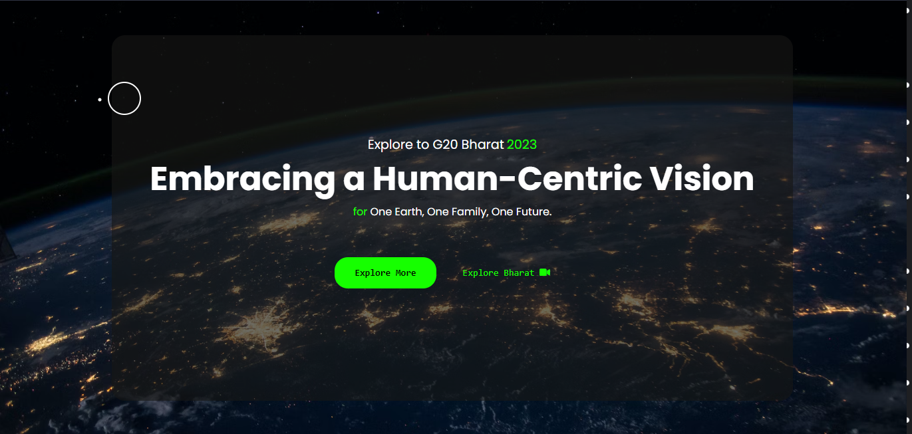
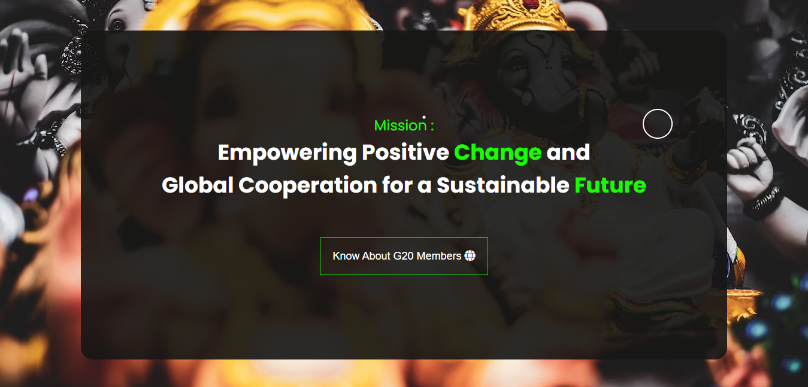
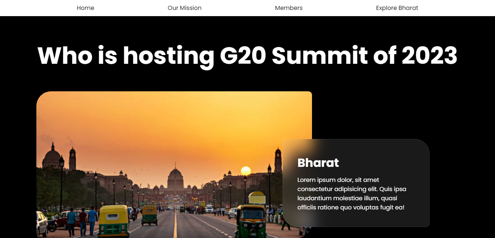
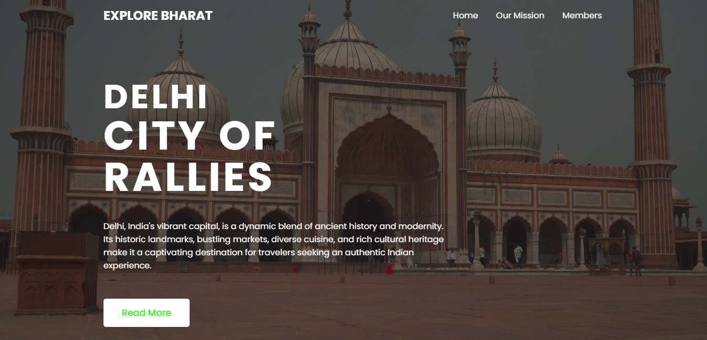

# G20 2023 | Hosted by Bharat

The G20 summit of 2023, hosted by Bharat, promises to be a significant event on the global stage. The G20, short for the Group of Twenty, is an international forum comprising 19 of the world's largest economies and the European Union. Each year, member countries come together to discuss critical economic and geopolitical issues. This year, the summit will be held in Bharat, shining a spotlight on this rapidly emerging economic powerhouse.

Bharat, is a nation with a rich history and a rapidly growing economy. Its hosting of the G20 summit underscores its increasing influence in global affairs. The summit provides Bharat with a unique opportunity to showcase its culture, heritage, and economic prowess to the world.

## Motive

The agenda for the G20 2023 summit is expected to be diverse, covering topics such as climate change, trade, digitalization, and global health, among others. Leaders from the member countries will engage in discussions, negotiations, and partnerships aimed at addressing some of the most pressing challenges facing the world today.

The G20 2023 summit in Bharat is not only a gathering of world leaders but also a symbol of the nation's commitment to playing a vital role in shaping the global future. It serves as a platform for collaboration and cooperation, highlighting the importance of working together to build a more stable and prosperous world for all. As the summit approaches, the world eagerly awaits the outcomes and agreements that will emerge from this pivotal event.
## Authors

- [@Mrinal Pramanick](https://mrinal-portfolio.vercel.app)

- [@Arpit Singh](https://github.com/Maureen0001)


## Tech Stack

**Technologies Used:** HTML, CSS, Vanilla Js


## Deployment

Our Project is deployed on the following link given below

```bash
  https://g20-2023.vercel.app
```


## Screenshots


### Home Page


### Our Mission Page


### Invited Countries Page


### Explore Bharat Page


# 

